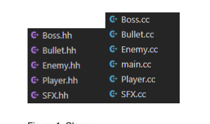
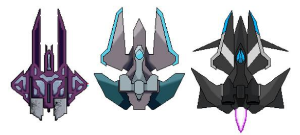
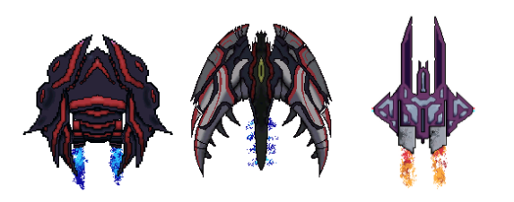
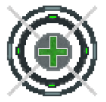
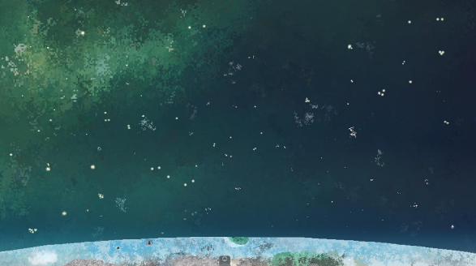
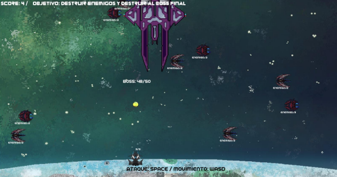

# SFML_-Game-Final

Final Project Data Structure
Abstract
In this research you can find the process for this video game, the
which was created using C++, the SFML libraries for the code and the physics,
while Aseprite was used to make the sprites and animations. The game is
inspired by some simple classic games, but aiming to recreate the
experience they offered, with a more modern and detailed aesthetic. It will be possible
appreciate the process that went into creating the game, both technical and
creative, and how long it took to make, through descriptions and screenshots
screen of the work that has been done.

Introduction
In 1978, a game titled Space Invaders designed by Toshihiro was created.
Nishikado. The game is a classic two-dimensional Shoot 'Em Up. The player
controls a cannon that can move left or right and a button
Shooting. He has to go destroying the invading aliens (of which there are
three types) that are approaching the earth more and more rapidly as
The player destroys the enemies. Its mechanics are still good,
although aesthetically, the graphics are too simple, the enemies and objects
They are a single color, with a black background. Additionally, the player is limited to only
move from right to left. On the other hand, the game that is being played in
This project will be done in C++, and using libraries such as SFML. The player
You will be able to move freely around the map, and the game will be more detailed and colorful. HE
decided to use SFML, since it provides the necessary tools to perform the
project in a comprehensible way in a short period of time. SFML
provides a simple interface to the various components of a PC, to
facilitate the development of games and multimedia applications. It is made up of five
modules: system, window, graphics, audio and network. Likewise, it was decided to use
the application called Asesprite to make both sprites and animations, from
the designs of the ships, enemies, background and other objects on the stage.

Background
Atom Zombie Smasher, is a game that was released in 2011, The story
is about a zombie apocalypse, where the player is in charge of evacuating the
civilians and kill the zombies. The game was also created with the help of SFML.
The maps in the campaign are procedurally generated, that is, they are
different with each time they are played. The game is in 2D, all the visuals are Sprites
that are being drawn on the screen.

Project Black Sun is a game that was released in 2012, by Star Flower Games.
Uses SFML for window creation, image loading, input handling,
loading and playing sounds and background music.

Zeran's Folly is an action-adventure platform game based on a
story with fluid combat. It was developed by Myroid-Type Comics in 2013.
The game has a 2D plane and consists mostly of fighting enemies and
bosses. It is built in C++ and uses the SFML modules: graphics, windows,
system and audio. It was developed mainly to be used on the web with flash,
but now it is available on Steam, where it is programmed with C++ and SFML. He
game is similar to Zelda, where you go to a place, defeat enemies in a
dungeon, you get something, you go to the next place, etc.

The Red Solstice is a squad-based tactical survival game
set in the distant future on Mars, which can be played in single player or
with up to 8 players in online cooperative multiplayer. This game uses
SFML, although it does not use it for the entire game. The input input is made for
that works with SFML, window and sound system. The game went on sale
in 2015.

Another game in which SFML was used is called Leowald, developed by Myroid.
Type Comics, in 2018. All SFML parts were used except the module
of networks. RenderTexture and shaders are widely used to generate art.
level, using input from a custom level editor I made. The others

Main libraries and tools I use are Spine for animations,
Box2D for collision testing, GLM for some math functions and SDL,
but only for controller vibration functionality.

Another game made with C++ and SFML is titled MoonQuest, released in
2018 on various Indie game distribution pages. It's an adventure game
procedurally generated, where worlds with wild forests are explored,
Ice-covered mountains and ancient ruins.

Development
The code is divided into several classes, each of them is made so that
perform a special function.

The Bullet class works as follows, it contains the indicated texture for
give personality to our shot, containing the necessary vectors and with the
suitable position so that it appears from our ship and continues with his
corresponding address.

Boss is a class dedicated to the final enemy of the game, which is static but has
much more life compared to the other enemies.

The Enemy class has a functionality in which it contains an integer which indicates
their lives and how they will disappear when they are hit by the bullet, in addition to
its appearance time and position, quantity and speed. They can go down
the player's life by touching it.

Player has a specific texture size, position and special life for him,
where this is called to obtain the characteristic of our player.

The last class is the SFX class, which is responsible for storing the effects of
sound so that they can then be used when they are needed, either when there is a
explosion, or a bullet is fired.

Figure 1. Classes

The sprites were drawn and animated using Aseprite. To create the player,
First it was thought about how it should be, its shape, its colors, etc. using images
of references for them, in addition to using guides for their modeling. Through the
palettes that the program offers us, we use a series of colors which
will indicate who the player was, going so far as to use a purple tone, but taking into account
realized that this gave us the feeling of an enemy, so we opted for a
more grayish color for this one; adding animations when idle,
in the flames of the ship's fire, in addition to an effect when it comes to being destroyed.

Figure 2. Player Ship: Before and After

For the enemy ships, the same approach was used but based on
different models for creating these and using the palettes that we
will indicate at a glance who the attackers were, in addition to taking advantage of the first
player model to use as an enemy. The design of the other two are

following: the first is black with red accents and has an insectoid shape. Is he
weaker enemy. The second nave, black and silver, with red accents,
It is a faster ship and a little more resistant. While the third ship is
More like a direct antagonist to the player, it is the fastest and strongest ship of the
3, but they are rarer.

Figure 3. Enemy ships

The stations were intended to be used as cover for the player, these would suffer
damage if they collided with an enemy ship, but due to some changes it was decided
modify that idea, causing them to serve to cure the damage caused by
the enemies which will be found on the map.

Figure 4. Health station

The map is space, above the Earth's atmosphere. At the bottom,
Find the planet that must be protected. While the enemies come
on the right side of the map, and the player has to destroy them.

Figure 5. Background

Results
The final result was a game where they will have to shoot at enemy ships
to save the planet from alien attack, where the player will control the ship
space, shooting at the enemies that come out from the right side of the map, the
which when colliding with us will lower our life with the aim of eliminating them from the
map; To beat them we will be able to shoot and obtain points through them.
Let's eliminate these individuals, until we reach the necessary score to
face the final enemy and stop him. The game has sprites created without
no errors in them, in addition to having music for the atmosphere during
the match. In addition to being able to recover life through the seasons that are
used for it.

Figure 6. Results

Conclusions
This project served a lot of learning for us with C++ and SFML, since
Now we have more knowledge about the creation of video games and more than anything
about the use of memory pointers and the use of public and private classes in
this programming language. Greater knowledge was also gained
on the use of vectors in C++ and SFML, along with audio implementation.
In addition to this, we learned to use the Aseprite program, with which we made
the sprites used in this game. We think it is a good game and it achieved what it wanted.
we set out to achieve at the beginning of the project.
